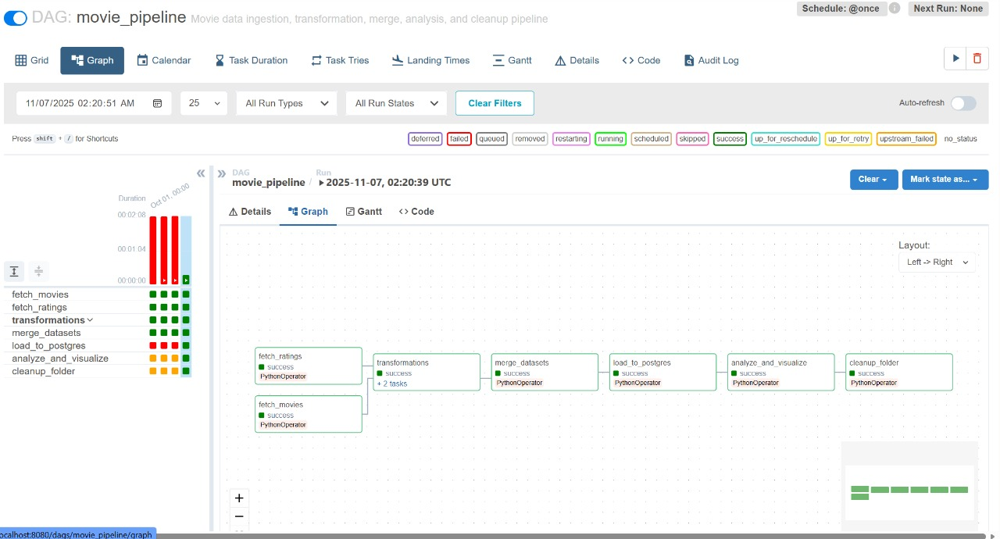
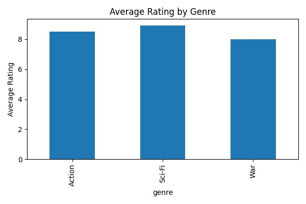

# Airflow Assignment: Movie Data Pipeline
### Author: Ananya Jogalekar (aj463)

# Overview
This project implements an end-to-end data pipeline using Apache Airflow to ingest, transform, and analyze two related movie datasets: one with movie details and another with user ratings. The pipeline demonstrates workflow orchestration, task parallelism, database integration, and automated analytical visualization.

### Key Technologies: 
Apache Airflow, Pandas, Matplotlib, PostgreSQL, Docker


# Repository Structure -- TBC
```markdown
DE-Airflow/
├── movie_dags_pipeline.py           # Airflow DAG
definition
├── images/                          # Screenshots for documentation
│   ├── dag-execution.jpg
│   └── data-viz.jpg
├── docker-compose.yml               # Airflow & PostgreSQL services
├── requirements.txt                 # Python dependencies
└── README.md                        # Project documentation
```

# Pipeline Workflow
```
Fetch Movies & Ratings → Transform → Merge → Load to PostgreSQL → Analyze → Cleanup
```

The DAG orchestrates the entire workflow, with parallel ingestion transformation, analysis, visualization, and cleanup.



# Tasks

1. **Fetch Movies** (`fetch_movies`) – Generates a synthetic dataset with movie titles, genres, and release years.

2. **Fetch Ratings** (`fetch_ratings`) – Creates a related dataset with user ratings linked by movie_id.

3. **Transformations**
    - Movies (`fetch_movies`): Adds a derived `decade` column based on year.
    - Ratings (`fetch_ratings`): Categorizes ratings as Low, Medium, or High.

4. **Merge Datasets** (`merge_datasets`) – Combines movies and ratings data on `movie_id`.

5. **Load to PostgreSQL** (`load_to_postgres`) – Loads the merged data into `week9_movies.movies_final` schema and table.

6. **Analyze & Visualize** (`analyze_and_visualize`) – Computes average ratings by genre and generates a bar chart.

7. **Cleanup** (`cleanup_folder`) – Removes intermediate CSV files to maintain a clean workspace.


# Output and Visualization
Visualized bar chart showing the "Average Rating by Genre":




# Tech Stack
| Component | Technology |
|-----------|-----------|
| Orchestration | Apache Airflow 2.8 |
| Data Processing | Python (Pandas) |
| Database | PostgreSQL 15 |
| Visualization | Matplotlib |
| Containerization | Docker |
